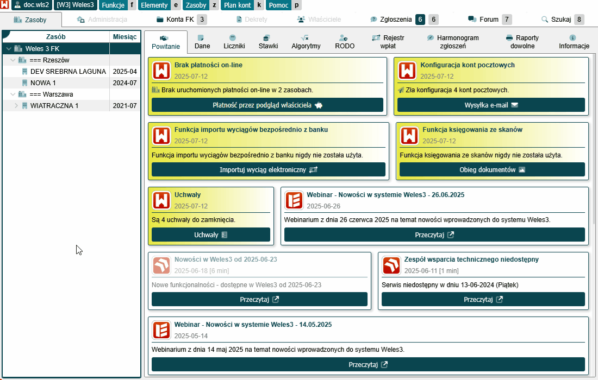

# Księgowanie dokumentów

Gdy dokumenty są już umieszczone na dysku Google, można przejść do wprowadzania dekretów w programie, na ich podstawie. W tym celu należy przejść do:

- Zakładka `Zasoby` > menu `Funkcje` > `Obieg dokumentów`.

Dokumenty wprowadzamy w zakładce `Księgowanie`.

W tej zakładce mamy następujące opcje:

- Pole `Typ podglądu` > odpowiada za podgląd pliku w prawej części okna:
    - `Bezpośredni` > podgląd pliku pochodzi bezpośrednio z dysku Google.
    - `Pośredni` > podgląd pliku pochodzi z serwerów Weles 3, wybieramy tą opcję gdy nie mamy dostępu lub nie jesteśmy zalogowani w przeglądarce do konta Google na którym znajdują się pliki do zaksięgowania.
- Pole `Konto` > wybieramy konto Google z którego będziemy księgować pliki.
- Przycisk `Odśwież` > klikamy wtedy gdy chcemy odświeżyć listę plików do zaksięgowania.

#### Księgowanie dokumentu — Krok 1

Jako pierwsze zawsze wybieramy prawidłowe konto Google oraz plik, który będziemy wprowadzać. System będzie automatycznie rozpoznawał i podpowiadał nieruchomość i kontrahenta na liście plików, jeżeli podobne koszty były już księgowane.

Po wybraniu pliku klikamy `Księguj Fakturę`.

#### Księgowanie dokumentu — Krok 2

Zostaniemy przeniesieni do okna księgowania kosztów. Ustawiamy odpowiednie wartości w polach:

- Pole `Zasób` > wybieramy budynek/wspólnotę.
- Pole `Kontrahent` > wybieramy dostawce usługi lub towarów.
- Pole `Miesiąc księgowania` > określamy miesiąc księgowania. 
- Pole `Data pozycji` > ustawiamy datę pozycji.
- Pole `Termin płatności` > Ustawiamy termin płatności kosztu.
- Pole `Nazwa (dowód)` > podajemy numer faktury.
- Pole `Treść` > wpisujemy opis księgowania.

#### Księgowanie dokumentu — Krok 3

Następnie należy wprowadzić pozycje z faktury kosztowej. Oczywiście można się posiłkować tekstem rozpoznanym przez system OCR, jaki i skanem dokumentu w dolnej części strony.

- Pole `Typ pozycji` >
    - Pole `Księgowanie kosztu` > wybieramy, gdy księgujemy pozycję kosztową.
    - Pole `Kwota VAT` > używane przy księgowaniu kosztów z VATem.
- Pole `Konta dotychczasowe` > jeśli koszt był już dodawany, to zostaną tutaj podpowiedziane wcześniej wybrane konta.
- Pole `Konto` > wskazujemy konto kosztu.
- Pole `Treść` > wpisujemy opis.
- Pole `Kwota` > podajemy kwotę.
- Klikamy: `Dodaj`.

Jeśli na dokumencie znajdują się kolejne pozycje, to wprowadzamy je.

#### Księgowanie dokumentu — Krok 4

Gdy wszystkie pozycje danego dokumentu zostaną wprowadzone i sprawdzone, można zapisać dokument.

- Klikamy: `Zatwierdź`.

Okno nie zamknie się, dodawany dokument zniknie z listy — oznacza to, że został poprawnie wprowadzony w systemie. Po tym można przystąpić do wprowadzania kolejnego dokumentu.

